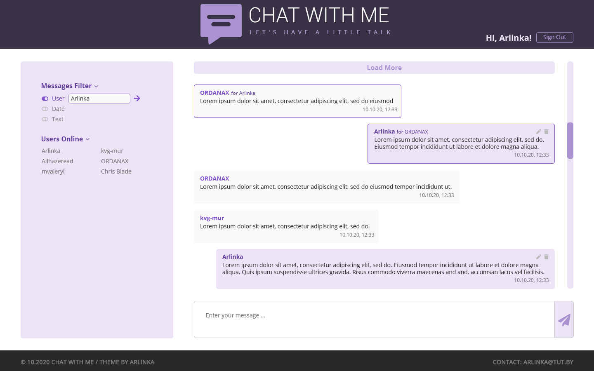

# Chat With Me

**Chat With Me** is a system that allows users to communicate in real time. All users can add, edit and delete own messages. All screens and functions of the chat should work without reloading the page.

## Chat Pages
- Home / Message List
- Authorization form
- Registration form
- Error page

## Glossary:

### Application Users (Users):
 - **Guest** - Unregistered user. All users are guests by default.
 - **Registered User**

## Use cases

1. User can SignIn / SignOut by using email and password

2. Registered User can add, edit and delete own message (fill with Autor, Date, Text). User can write private messages to another user.

3. Ability to view all messages for Unregistered Users.

4. Messages can be filtered by: 
- Author's name
- Date
- Text

## Non-functional requirements
-   Project type: SPA (Single Page Application)
-   Supported Browsers: Latest version of Chrome

## Mookups

